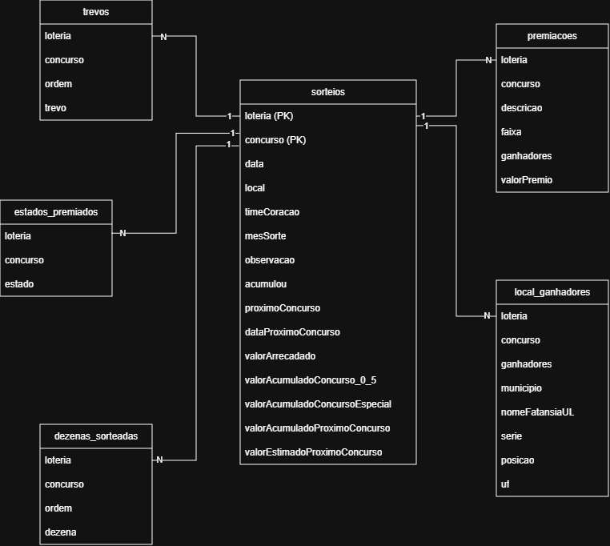

# loterias-etl-pipeline
Pipeline para Processamento de Dados de Loterias.

Este projeto implementa um pipeline ETL (Extract, Transform, Load) em Python para coletar, limpar, transformar e armazenar dados de sorteios de loteria.
Os dados são processados e armazenados em um banco SQLite.

## Arquitetura e modelagem
O projeto segue a Arquitetura de Medalhão, dividida em:
- **Bronze**: dados brutos
- **Silver**: dados limpos e padronizados
- **Gold**: dados refinados e prontos para análise

Os dados foram modelados em 6 tabelas, de acordo com o DER abaixo:



## Processo ETL
### Extract
Etapa em que se realiza a leitura dos dados de um JSON. O arquivo está no caminho `data/bronze/dataset.json`.
### Transform
Nesta etapa são aplicadas todas as transformações necessárias para garantir a qualidade, padronização e consistência dos dados. As principais operações realizadas foram:
- **Remoção de registros completamente nulos**: Eliminação de linhas onde todos os campos estão vazios, garantindo que apenas dados válidos sejam processados.
- **Filtragem de concursos válidos**: Manutenção apenas dos registros em que o campo concurso não é nulo.
- **Tratamento de duplicidades**: Deduplicação das linhas com base em chaves relevantes, assegurando que não haja dados repetidos no dataset.
- **Padronização de datas**: Conversão de todos os formatos possíveis (ex.: yyyy-mm-dd, yyyy/mm/dd, dd/mm/yyyy, dd-mm-yyyy) para o padrão ISO 8601 (yyyy-mm-dd).
- **Limpeza e normalização de strings**: Aplicação de trim para remover espaços em excesso e remoção de caracteres especiais/ASCII indesejados.

Após as transformações, os dados são quebrados em múltiplos DataFrames, cada um representando uma entidade/tabela do modelo analítico. Em seguida, esses DataFrames são armazenados na camada Silver, dentro da pasta `data/silver/`, no formato Parquet, já padronizados e prontos para a etapa de carregamento.
### Load
Por fim, essa etapa carrega os DataFrames gerados na etapa anterior em um banco de dados SQLite nas tabelas definidas na modelagem (sorteios, premiacoes, local_ganhadores, estados_premiados, trevos, dezenas_sorteadas). O arquivo final do banco se encontra no caminho `data/gold/loterias.db`.


## Requisitos e dependências
O projeto foi desenvolvido utilizando as seguintes tecnologias
 - Python 3.12.5
 - SQLite3

As dependências estão no arquivo requirements.txt.


## Como executar
1. Clone o projeto do Github
    ``` bash
    git clone https://github.com/LarissaAsito/loterias-etl-pipeline.git
    cd loterias-etl-pipeline
    ```
2. Crie e ative um ambiente virtual (venv)
    ``` bash
    python -m venv .venv
    source .venv/bin/activate
    ```
3. Instale as dependências
    ``` bash
    pip install -r requirements.txt
    ``` 
4. Execute o arquivo main
    ``` bash
    python src/main.py
    ```
